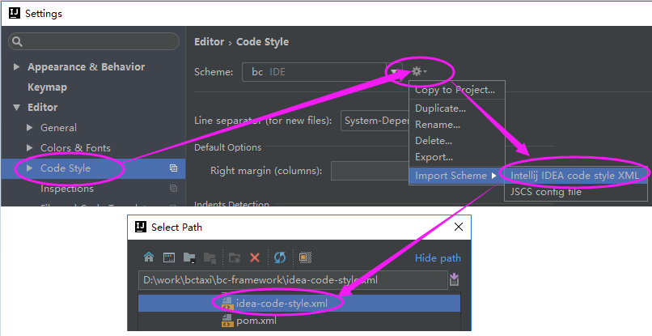

# BC 系统开发环境配置

## 1. 安装配置 Java 开发环境

我们的项目开发需要 JDK 1.8 以上的版本。推荐安装绿色版的 JDK，解压后配置环境变量即可直接使用。

### 1.1. 安装

内网用户可用 ftp 工具（[FlashFXP5+](http://pan.baidu.com/s/1o8LnHcI) 或 [CuteFTP9+](http://pan.baidu.com/s/1o7H9HhC)）到 192.168.0.222 (账号密码均为 reader) 下载绿色版的 JDK 1.8，文件路径为 `/file/tools/java/jdk/green/jdk1.8.0_102_x64.7z`。或者下载我们上传到百度云的这个绿色版，点 [这里](http://pan.baidu.com/s/1kUQ3uIj)。

也可到 Oracle 官网下载最新安装版的 [Java SE Development Kit (JDK)](http://www.oracle.com/technetwork/java/javase/downloads/index.html) 自行安装。

确认解压后（绿色版）或安装后（安装版）的目录结构如下：

```
/your/path/to/jdk/jdk1.8.0_102_x64/bin
                                  /jre
                                  /lib
                                  /...
```

### 1.2. 配置环境变量

添加系统环境变量 `JAVA_HOME`，路径指向上面的安装路径。

```
JAVA_HOME = /your/path/to/jdk/jdk1.8.0_102_x64
```

对于 Windows 系统，Path 环境变量添加 `%JAVA_HOME%\bin`。  
对于 Linux、MacOS 系统，PATH 环境变量添加 `$JAVA_HOME/bin`。

### 1.3. 验证安装配置的正确性

命令行执行 `java -version` 命令，能看到类似如下的版本信息输出，即表示安装配置正确：

```
java version "1.8.0_102"
Java(TM) SE Runtime Environment (build 1.8.0_102-b14)
Java HotSpot(TM) 64-Bit Server VM (build 25.102-b14, mixed mode)
```

## 2. 安装 Maven

我们的开发环境需要 Maven 3.3 以上的版本。从官网下载的压缩包就是绿色版的，解压后配置环境变量即可直接使用。

### 2.1. 安装

到 [Maven 官网](http://maven.apache.org/) 下载最新版的 maven 二进制包，如 [apache-maven-3.5.0-bin.tar.gz](http://mirrors.hust.edu.cn/apache/maven/maven-3/3.5.0/binaries/apache-maven-3.5.0-bin.tar.gz)。将 `apache-maven-3.5.0-bin.tar.gz` 解压到 `/your/path/to/maven`，确认解压后的目录结构如下：

```
/your/path/to/maven/apache-maven-3.5.0/bin
                                      /boot
                                      /conf
                                      /lib
                                      /...
```

### 2.2. 配置环境变量

添加系统环境变量 `M2_HOME`，路径指向上面的安装路径。

```
M2_HOME = /your/path/to/maven/apache-maven-3.5.0
```

对于 Windows 系统，Path 环境变量添加 `%M2_HOME%\bin`。  
对于 Linux、MacOS 系统，PATH 环境变量添加 `$M2_HOME/bin`。

### 2.3. 增加 Maven 用户配置文件

在用户目录下创建 `.m2` 目录：

Windows 系统执行如下命令:

```
> C:
> cd %USERPROFILE%
> md .m2
```

Linux、MacOS 系统执行如下命令:

```
$ cd ~
$ mkdir .m2
```

下载并拷贝 [settings.xml](https://git.oschina.net/bctaxi/bc-start/blob/master/settings.xml) 文件到 `.m2` 目录，并将文件内 `localRepository` 节点的值修改为有效的路径，如：

```
     Windows: <localRepository>D:/Repositories/MavenRepository</localRepository>
Linux、MacOS: <localRepository>~/MavenRepository</localRepository>
```

若在外网环境，注意 `settings/profiles/profile(id=lan)` 节点的值需要根据实际环境进行相应的修改。

### 2.4. 验证安装配置的正确性

命令行执行 `mvn -v` 命令，能看到类似如下的版本信息输出，即表示安装配置正确：

```
Apache Maven 3.5.0 (ff8f5e7444045639af65f6095c62210b5713f426; 2017-04-04T03:39:06+08:00)
Maven home: D:\green\apache-maven-3.5.0\bin\..
Java version: 1.8.0_102, vendor: Oracle Corporation
Java home: D:\green\jdk1.8.0_102_x64\jre
Default locale: zh_CN, platform encoding: GBK
OS name: "windows 10", version: "10.0", arch: "amd64", family: "windows"
```

## 3. 安装 Git

我们的开发环境需要 Git 2.9 以上的版本。


### 3.1. 安装

到 [Git 官网](http://git-scm.com/downloads) 下载适合的平台版本安装即可，如：  

》 Windows: 下载安装 [Git-2.13.1.2-64-bit.exe](https://github.com/git-for-windows/git/releases/download/v2.13.1.windows.2/Git-2.13.1.2-64-bit.exe)，注意安装到 `Select Components` 界面时，要选择如下安装选项:

```
- [x] Windows Explorer integration
    - [x] Git Bash Here
    - [x] Git GUI Here
```


》 Ubuntu: `$ apt-get install git`

》 MacOS: 下载安装 [git-2.13.1-intel-universal-mavericks.dmg](https://sourceforge.net/projects/git-osx-installer/files/git-2.13.1-intel-universal-mavericks.dmg/download?use_mirror=autoselect)

### 3.2. 验证安装的正确性

命令行执行 `git --version` 命令，能看到类似如下的版本信息输出，即表示安装配置正确：

```
git version 2.9.0.windows.1
```

如果是 Windows 系统，在资源管理器空白的地方点击鼠标右键，能够看到 `Git Bash Here` 和 `Git GUI Here` 两个菜单项就证明安装 OK，点击 `Git Bash Here` 菜单项就可进入 `Git 命令行`，如下图所示：

  


## 4. [可选] 配置 ssh key

如果已经有相应的密钥对，可以直接将私钥放到 `%USERPROFILE%/.ssh` (Windows) 或 `~/.ssh` (Linux、 MacOS)` 目录下即可。如果还没有密钥对就按如下步骤创建：

1. 打开 Git 的命令行窗口，输入`$ ssh-keygen -C "your@email.com" -t rsa`，按提示输入相关信息生成 rsa key（注意email地址按你的实际输入）；默认就会在用户目录下创建名为 `.ssh` 的目录，并在该目录下生成两个文件：`id_rsa.pub` (公钥) 和 `id_rsa` (私钥)。
2. 如果想修改上面创建的密钥的密码，执行命令 `$ ssh-keygen -f '/c/Documents and Settings/yourName/.ssh/id_rsa' -p`，根据提示输入原来的密码和设置新的密码即可。

## 5. [可选] 安装 TortoiseGit (Windows)

到 [TortoiseGit 官网](https://tortoisegit.org) 下载安装 TortoiseGit，内网用户可到 `192.168.0.222 /file/tools/win/git/TortoiseGit-2.4.0.2-64bit.msi` 下载，汉化：`192.168.0.222 /file/tools/win/git/TortoiseGit-LanguagePack-2.4.0.0-64bit-zh_CN.msi`。

安装成功后会在资源管理器的鼠标右键菜单中看到相应的选项，如下图所示：  


## 6. 安装数据库

我们的项目使用 [PostgreSQL](https://www.postgresql.org) 9.5+ 数据库（推荐安装官方绿色版），下载安装后，创建名为 bcsystem 的开发数据库（拥有者的账号密码也同时设置为 bcsystem），
创建成功后，向管理员索要开发环境使用的数据库备份文件，将其导入到刚创建的 bcsystem 数据库中即可。  
以下为 Windows 的安装、初始化范例：

### 6.1. 下载安装绿色版 PostgreSQL

到 [PostgreSQL 官网](http://get.enterprisedb.com/postgresql/postgresql-9.5.4-1-windows-x64-binaries.zip) 下载或局域网到 `192.168.0.222 /file/tools/win/postgresql/9.5/postgresql-9.5.3-1-windows-x64-binaries.zip` 下载，解压到 `/your/path/to/postgresql`，确认解压后的目录结构如下：

```
/your/path/to/postgresql/bin
                        /lib
                        /share
                        /...
```

### 6.2. 配置环境变量

将 `/your/path/to/postgresql/bin` 添加到环境变量 `Path` 内。

### 6.3. 初始化绿色版数据库

```
# 创建数据目录  
> md /your/path/to/postgresql/data

# 执行命令初始化绿色版数据库  
> initdb -D "/your/path/to/postgresql/data"

# 启动数据库  
> postgres -D "/your/path/to/postgresql/data"
```

### 6.4. 命令行创建 BC 系统需要的 bcsystem 数据库

数据库启动成功后，命令行输入 `psql -dpostgres` 登录数据库管理端，如下图所示：  


登录后，执行如下命令创建账号、数据库：

```
# 创建登录密码为 bcsystem 的 bcsystem 账号  
postgres=# create role bcsystem login password 'bcsystem';

# 创建 owner 为 bcsystem 的 bcsystem 数据库  
postgres=# create database bcsystem with encoding 'UTF-8' owner bcsystem;

# 退出 postgres 的登录
postgres=# \q;
```

### 6.5. 导入备份的 bcsystem 数据库

用如下命令行导入开发环境数据库：

```  
> psql -dbcsystem -Ubcsystem < xxx.sql
```

注：xxx.sql 数据库备份文件需向管理员索取。

### 6.6. 使用 pgAdmin3 客户端连接数据库

运行 /your/path/to/postgresql/bin/pgAdmin3.exe，添加数据库连接，如下图所示：  
  
  

用 pgAdmin3 即可对数据库进行相应的维护操作，如 select、update、delete 等。

## 7. 检出并启动 BC 系统

BC 系统的业务模块代码统一放在 https://git.oschina.net/bctaxi 上，请将你的码云账号告知管理员，让其分配好项目的相关权限后再执行下面的相关操作。

### 7.1. 检出 BC 系统源码

```
$ cd /d/work/bctaxi
$ git clone git@git.oschina.net:bctaxi/bc-system.git
$ cd bc-system
$ git submodule init
$ git submodule update
```

### 7.2. 启动 BC 系统

```
$ cd bc-system
$ mvn jetty:run -Ppostgresql -Dapp.debug=true -Djetty.path=/test -Djetty.port=8081
```

系统成功启动后访问地址为：<http://localhost:8081/test>。

## 8. 安装 IntelliJ Idea 开发环境

以下以 Windows 系统为例子，详细说明 [IntelliJ Idea](http://www.jetbrains.com/idea/) 的安装配置，请自行下载最新版本安装，以下的截图是 `2016.2` 版的，新版本的参考进行设置即可：

### 8.1. 下载安装

推荐下载安装旗舰版，社区版的功能比较弱，但也可以使用。官网下载地址为 <http://www.jetbrains.com/idea>，局域网可以到 `192.168.0.222 /file/tools/java/idea/ideaIU-[version].exe` 下载。

### 8.2. 项目编码设置

导航至 `File/Other Settings/Default Settings...->File encoding` 菜单，
将 `IDE Encoding` 和 `Project Encoding` 设置为 `UTF-8`。

### 8.3. 属性文件中文转码设置

导航至 `File/Other Settings/Default Settings...->File encoding` 菜单，选中 `Transparent native-to-ascii conversion`，参考下图：  


设置后，默认情况下 IDEA 将属性文件中的 Unicode 编码保存为大写，我们项目要求保存为小写，故需修改 `bin/idea.properties` 文件，增加 `idea.native2ascii.lowercase=true` 属性配置。

### 8.4. 文件缩进设置

文件缩进设置有用 tab 键和 2 个空格两种，以前遗留的所有的 [bctaxi]、[bc-framework] 下的项目统一使用 tab 键缩进，新的 [gftaxi]、[simter] 下的项目统一使用 2 个空格的缩进，请特别留意不要混淆。

[gftaxi]、[simter] 项目需加载 [simter-parent/.../idea-code-style.xml](https://github.com/simter/simter-parent/blob/master/idea-code-style.xml) 配置文件。

[bctaxi]、[bc-framework] 项目需加载 [bc-framework/.../idea-code-style.xml](https://github.com/bcsoft/bc-framework/blob/master/idea-code-style.xml) 配置文件。

参考下图进行配置：  


上述两个配置文件，本质上是导航至 `File/Other Settings/Default Settings...->Editor/Code Style/Java` 菜单，进行相应的配置。

### 8.5. [可选] 显示文件的空格和换行符设置

推荐在代码编辑器中显示文件的空格和换行符设置，这方便肉眼看到实际的缩进符号是什么，避免不必要的格式混乱。配置方式为导航至 `File/Settings...->Editor/General/Appearance` 菜单，选中 `Show whitespaces` 和 `Show line numbers`，参考下图：  


配置后编辑器内的显示效果详见这个链接：[让 JAVA 编辑器显示空格(Space)和制表符(Tab) ](http://rongjih.blog.163.com/blog/static/33574461201462394750228/)。

### 8.6. 导入 BC 系统源码项目

1. 导航至 `File/New/Project from Existing Sources...` 菜单。
2. 在弹出的对话框中选中项目 `D:/work/bctaxi/bc-system，然后点击 OK 按钮继续。
3. 选中 `Import project from external model` 和 `Maven`，点击 `Next` 继续，如下图所示：
  
4. 接下来就一路 `Next` 即可。

### 8.7. 在 idea 内运行 BC 系统

按下图所示进行配置：
 

命令行参数为 `jetty:run -Dapp.debug=true -Djetty.path=/test -Djetty.port=8081`。  
配置完成后点击下图中的 Run 或 Debug 按钮即可启动系统：  


系统成功启动后访问地址为：<http://localhost:8081/test>

## 9. [可选] 安装 Eclipse 开发环境

按如下步骤安装配置 Eclipse：

### 9.1. 安装 Eclipse

[官网下载](https://eclipse.org/downloads/) 或到 `192.168.0.222 /file/tools/java/eclipse/eclipse-jee-mars-1-win32-x86_64.zip` 下载绿色版 eclipse，将其解压后即可直接使用（运行 eclipse.exe 文件），其目录结构如下：

```
/path/to/eclipse/configuration
                /dropins
                /plugins
                /eclipse.exe
                /...
```

### 9.2. 安装插件

将 `192.168.0.222 /file/tools/java/eclipse/dropins-mars/` 目录下的如下插件下载并解压到上面的 `eclipse/dropins` 目录，解压后的目录结构如下：

```
/path/to/eclipse/dropins/jd-eclipse-1.0.0         - 反编译插件
                        /properties-editor-6.0.4  - 属性文件编辑插件
                        /startexplorer-1.7.0      - 在浏览器中查看插件
                        /ermaster-1.0.0.v20150619 - 数据库设计插件
                        /wireframesketcher-4.4.9  - 界面原型设计插件
                        /activiti-designer-5.9.3  - Activiti 流程设计器插件
```

### 9.3. 配置工作空间使用UTF-8编码

如下图所示：  


### 9.4. 导入上面检出的 BC 系统源码项目

1. 导航至 File/Import...，  
2. 在弹出的对话框中选中项目 Maven/Existing Maven Projects，然后点击 Next 按钮继续  
  
3. 点击 Browse 按钮，选择项目 D:/Work/bc-system，然后点击 Finish 按钮完成导入  
 

### 9.5. 在 Eclipse 内运行 BC 系统

## 10. 参考资料

- [Maven 开发环境配置](http://rongjih.blog.163.com/blog/static/33574461201041615854740/)  
- [Maven 官方参考文档](http://maven.apache.org/guides/index.html)
- [Maven 权威指南](http://books.sonatype.com/mvnref-book/reference/index.html)
- [基于互联网的 Git 开发环境搭建 (Windows 系统)](http://rongjih.blog.163.com/blog/static/33574461201101504819691/)
- [Git 常用操作命令](http://rongjih.blog.163.com/blog/static/335744612010112562833316/)
- [PostgreSQL 脚本收集](http://rongjih.blog.163.com/blog/static/33574461201110300454392/)
- [IDEA 快捷键收集](http://rongjih.blog.163.com/blog/static/3357446120134793148413/)
- [Eclipse 中好用的项目原型设计插件 WireframeSketcher](http://rongjih.blog.163.com/blog/static/33574461201171023649680/)
- [Eclipse 中好用的 Properties Editor 插件(属性文件编辑器)](http://rongjih.blog.163.com/blog/static/335744612011211113352570/)
- [Eclipse 编辑技巧收集](http://rongjih.blog.163.com/blog/static/33574461201321815634218/)
- [Eclipse 的 Tab 宽度设置](http://rongjih.blog.163.com/blog/static/33574461201362595229871/)
- [让 JAVA 编辑器显示空格(Space)和制表符(Tab)](http://rongjih.blog.163.com/blog/static/33574461201462394750228/)


[simter]: https://github.com/simter
[gftaxi]: https://git.oschina.net/gftaxi
[bctaxi]: https://git.oschina.net/bctaxi
[bc-framework]: https://github.com/bcsoft/bc-framework